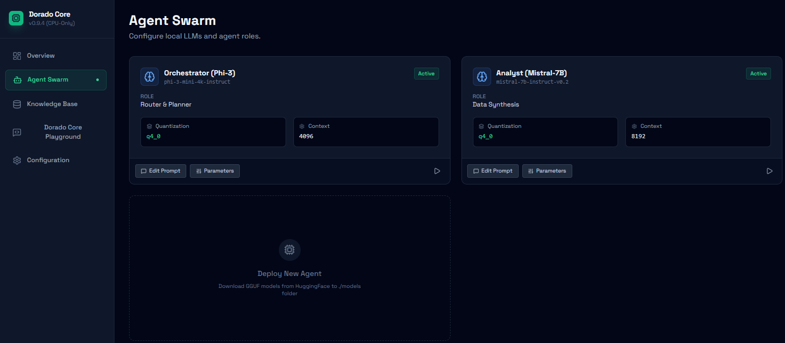

# Dorado Core

An agentic RAG AI platform core running fully on local hardware and no-GPU but only CPUs, with Python backend, open source.

## UI Preview

## Overview

Dorado Core is a high-performance, agentic RAG (Retrieval-Augmented Generation) platform designed to operate entirely on local hardware. By leveraging CPU-optimized inference pipelines (AVX2/AVX-512), it brings advanced AI capabilities to resource-constrained environments and privacy-centric deployments without requiring expensive GPU infrastructure.

## Key Features

- **Agentic Workflow**: Orchestrate multiple LLM agents for planning, data analysis, and synthesis.
- **CPU-Only Inference**: Optimized for running GGUF/quantized models (e.g., Mistral, Phi-3, Llama 3) purely on system processors.
- **Real-time Monitoring**: Integrated dashboard for tracking CPU load, RAM pressure, and inference tokens-per-second.
- **Local Knowledge Base**: Persistent vector storage using ChromaDB with automated document ingestion and chunking.
- **Extensible Architecture**: Designed to interface seamlessly with Python-based backends (FastAPI/Flask) wrapping `llama.cpp` or `ollama`.

## Technology Stack

- **Frontend**: React 19, TypeScript, Tailwind CSS
- **Visualization**: Recharts for live telemetry data
- **Iconography**: Lucide React
- **Backend Compatibility**: Optimized for Python-based local LLM servers

## Getting Started

1. **Local Backend**: Ensure your Python inference server is running on `http://localhost:8000`.
2. **Environment**: This UI expects a system with at least 16GB of RAM for optimal performance with 7B parameter models.
3. **Models**: Place your `.gguf` models in the `./models` directory of your backend for the UI to recognize them.

---
*Dorado Core: Privacy-first, hardware-agnostic, local-first intelligence.*
